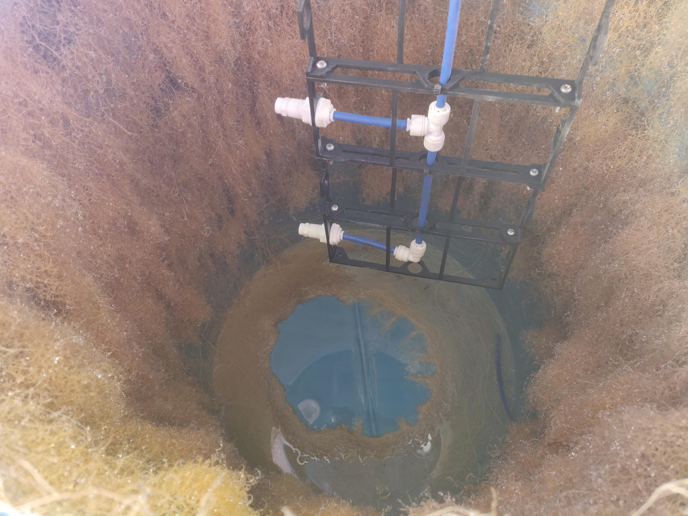
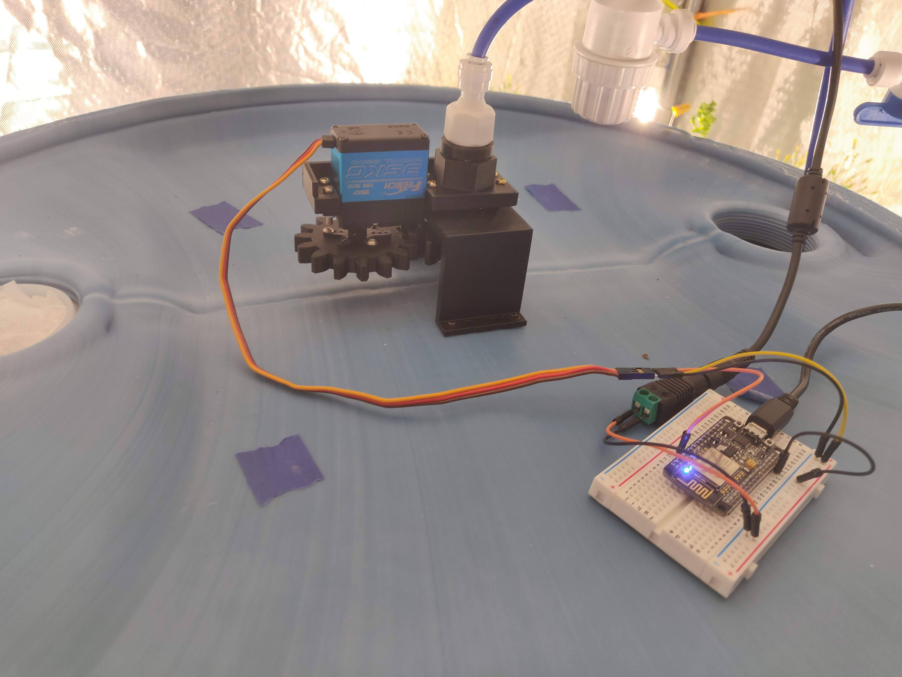

# TheFarm
High Pressure Aeroponics Experiment - <a href="https://photos.app.goo.gl/xgiAT7T5yuNJSb9R8">Project photo/video album</a>

## Features
* High pressure dispersion system
  * Maximized water usage, minimized waste that is drained off
  * Rotary Dispersion system
    * Equal dispersion
    * High plant/nozzle ratio
    * Very few nozzles to maintain pressure through the system
      * This could be achieved by different watering zones that turn on sequentially to maintain pressure, but some water is wasted at the start/end when pressure is not enough for aerosolization to occur.
* Automatic LED Lighting Configurable by software.
* Environmental Monitoring / Correction
  * Temperature and Humidity Monitoring
  * Automatic humidity correction
    * humidifier enabled based on vapor pressure deficit
    * Doing this in a grow tent was crucial for maintaining correct humidity
  * No Temperature Control, at the mercy of my decently insulated garage.
* Time Lapse Camera
  * Old Android device with an app that took a picture and uploaded it to S3. App was triggered periodically over ADB from a raspberry pi.
* Water reservoir level monitoring
  * Sonic sensor was used to find depth of the water tank, which was converted into a percent of remaining water.
* The Software integrated all of the above together
  * Based on events, the whole system is reactive to new data.
  * Historical events are Recorded in InfluxDB time series database.
  * Devices are controlled in a variety of manners
    * Wifi using mqtt
    * USB (android camera only)
    * Smart power strips with local network api.
      * Turning on on the High Pressure pump periodically.
      * Controlling lights on/off cycles
  * Energy Monitoring with smart power strips.

## Reliability
High reliability was a priority. This is the only project I've had where I was really forced to wait around on the time scale that plants grow at. This is magnified by the use of aeroponics which allows the roots to dry out very quickly if something goes wrong. Starting over is no fun.

There was at least two times where I left home for awhile, only to come back to my plants being dead. There were several other occasions where my plants were effecively on manual life support while I debugged issues.

I spent a lot of time ensuring my plants wouldn't die on me, and that everything would come back online automatically after events like a power outage, network issues, process failures, etc.

For my most recent crop, I let it do it's thing for weeks at a time without any intervention except to refill consumables.

## Barrel Changes

### V1
Initially I used pvc to make net cup mounts because it was readily available. Unfortunately cuttings ovals into the barrel was pretty time consuming. I also should've cut the pvc closer to the barrel, as it prevented water from getting to the base of the roots.

This setup did work for strawberries until I killed my plants from a software issue, but I started with dormant bare root strawberry plants that had roots long enough to not cause issues.

I tried on lettuce and this setup did not work at all.

---

### V2
For V2 of the barrel I wanted to cut down on manual labor for myself, so I designed this net cup bracket and 3D printed 48 of them. I used a 3 inch hole saw to cut the holes, and secured the brackets in place with stainless steel machine screws.

The curvature is TINY bit too aggressive, so I would fix that If I printed a new batch.

## Mister changes
I started out with Knex just to understand the spray pattern my misters had

The below mister is the first one I actually tried to grow plants with, although I quickly moved on.

---

This one could separately control the water flow in the top and bottom. Was not super great, but an improvement over the Knex designs

---

This next was modular and could stack vertically. I was able to play with the vertical spacing to distribute water where I wanted it. 

Although an improvement, it had a major problem of a long pressurization period due to having so many nozzles. Lots of wasted water that wasn't aerosolized.

---

Rotary Dispersion system - This one ended up working really well

<a href="https://photos.google.com/share/AF1QipN4WQcN4S6AX1Nvl3MuYThQZdT2KUuTPvhOaKNPEQhu93empHC7coNHhumvaoyn5g/photo/AF1QipPuxE0sy1xfddFc1j102-yCW6brzKu2pu6SkxFH?key=Ti1rcGtGTFJXbW9GamdTMGpzMjdSY29ESG5Mc2x3">Video of it in action</a>

